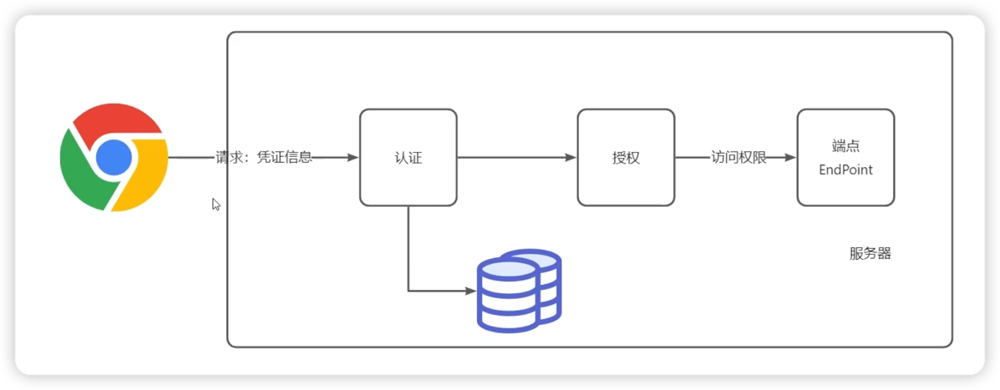

# SpringSecurity
SpringSecurity是一个提供身份验证、授权和针对常见攻击进行保护的框架。
它为web开发人员提供了验证、授权、安全防护等问题的解决方案，它主要包含以下功能：
1. 用户信息管理
2. 敏感信息加解密
3. 用户认证
4. 权限控制
5. 预防跨站请求伪造
6. 跨域支持
7. 全局安全方法
8. 单点登录 

# 认证和授权
 > 认证：Authentication 授权：Authorization

  软件体系中，开发人员将要访问的内容定义为=资源(Resource)=, 而安全设计的核心目的就是对这些资源进行保护，
确保对它们的访问是安全受控的。针对这些资源的可控访问，衍生出两个概念：认证（Authentication）和 授权（Authorization）
## 认证 Authentication 授权 Authorization
认证解决的问题是“你是谁”，也就是说，针对每次访问，系统都能判断出访问者是否具有合法的身份标识。
一旦明确了“你是谁”，下一步就能决定“你能做什么”，这就是授权。 通用的授权模型是基于权限管理体系的，
也就是说，授权是对`资源`、`权限`、`角色`、`用户`的一种组合处理。
将授权和认证结合起来，就构成了对系统中资源进行安全性管理的一种常见的解决方案：
    **判断资源访问者的有效身份，然后决定其是否有访问这个资源的合法权限**

以上就是认证和授权的解决方案，在不同的场景下，这一解决方案会有不同的实现。

## web认证授权体系
1. 认证的需求比较明确，需要构建一套完善的存储体系，来保存和维护用户信息，并确保这些用户信息在处理请求的过程中能得到合理应用。
2. 授权的情况较为复杂，尤其是对权限进行精细化管理，是授权体系的核心

## 单体应用
用户先通过请求传递身份凭证完成认证，然后根据用户所具备的角色获取对应的权限，并最终完成对HTTP端点的访问授权

## 微服务应用
对于微服务，情况比单体应用复杂，因为其涉及到服务和服务之间的通信。
在微服务系统当中，每个服务既可以是资源的提供者又可以是资源的消费者

在微服务架构中，由于开发人员需要把认证和授权的过程进行集中化管理，授权中心首先会获取客户端请求中的用户身份凭证，
然后基于这些凭证信息生成一个令牌(Token), 该令牌包含了权限范围和有效期。客户端拿到令牌后，就可以基于该令牌发起对微服务的访问，
此时，目标微服务需要对该令牌进行认证，然后根据令牌的权限范围和有效期从授权中心获取该请求所能访问的特定资源。

